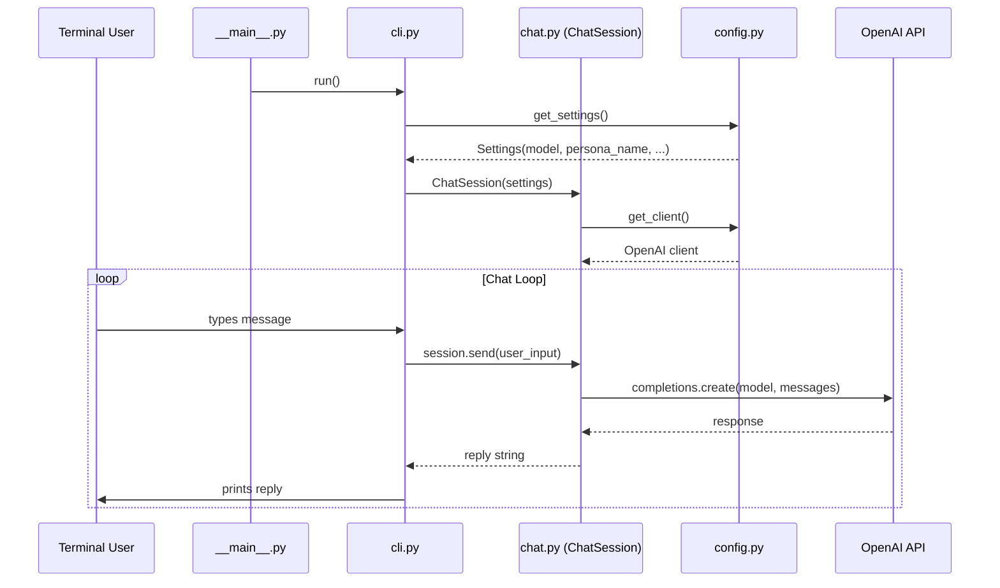

# 🧠 AI-Persona Codebase Walkthrough

> For a Node.js developer learning Python — explained in terms you already know.

---

## 1. The Big Picture — What This App Does

This is a **CLI chatbot** that talks like Salman Khan. It sends messages to the OpenAI API with a massive system prompt that defines the persona, and prints the AI's response in the terminal. That's it. Simple app, clean structure.

---

## 2. Project Structure — The Map

```
ai-persona/
├── .env                        ← API keys (like your .env in Node)
├── .gitignore                  ← ignore venv, .env, __pycache__
├── requirements.txt            ← like package.json dependencies
├── venv/                       ← like node_modules/ (virtual environment)
│
└── app/                        ← your source code (like src/ in Node)
    ├── __init__.py             ← marks "app" as a Python package
    ├── __main__.py             ← entry point (like "main" in package.json)
    ├── config.py               ← settings & OpenAI client setup
    ├── chat.py                 ← core chat logic (ChatSession class)
    ├── cli.py                  ← terminal input/output loop
    │
    ├── prompts/                ← sub-package for prompt content
    │   ├── __init__.py         ← marks "prompts" as a package
    │   └── system_prompt.py    ← the huge Salman Khan persona prompt
    │
    └── utils/                  ← empty for now, placeholder for helpers
```

---

## 3. Node.js ↔ Python Mapping (Mental Model)

| Node.js Concept | Python Equivalent | In This Project |
|---|---|---|
| `package.json` | `requirements.txt` | [requirements.txt](file:///c:/Users/abhis/OneDrive/Desktop/Gen-AI/ai-persona/requirements.txt) |
| `node_modules/` | `venv/` | Virtual environment directory |
| `npm install` | `pip install -r requirements.txt` | Install dependencies |
| `src/` folder | `app/` folder | Your source package |
| `index.js` (entry) | `__main__.py` | [\_\_main\_\_.py](file:///c:/Users/abhis/OneDrive/Desktop/Gen-AI/ai-persona/app/__main__.py) |
| `require()` / `import` | `from x import y` | Used everywhere |
| `module.exports` | Just define at top level | Python exports everything by default |
| `.env` + `dotenv` | `.env` + `python-dotenv` | Identical concept |
| `class` in JS | `@dataclass` in Python | [chat.py](file:///c:/Users/abhis/OneDrive/Desktop/Gen-AI/ai-persona/app/chat.py), [config.py](file:///c:/Users/abhis/OneDrive/Desktop/Gen-AI/ai-persona/app/config.py) |

---

## 4. File-by-File Breakdown

### 4.1 [\_\_init\_\_.py](file:///c:/Users/abhis/OneDrive/Desktop/Gen-AI/ai-persona/app/__init__.py) — The Package Marker (EMPTY but CRITICAL)

```python
# This file is empty. That's intentional.
```

#### Why does it exist?

In Node.js, any folder can have an `index.js` and you can `require('./folder')` — Node just figures it out. **Python is NOT like that.** Python needs you to explicitly say *"hey, this folder is a package you can import from"* — and `__init__.py` is how you say it.

#### Deep Explanation:

Think of Python's import system in 3 levels:

| Term | What it is | Node equivalent |
|---|---|---|
| **Module** | A single `.py` file | A single `.js` file |
| **Package** | A folder with `__init__.py` | A folder with `index.js` |
| **Sub-package** | A nested folder with its own `__init__.py` | Nested folder with `index.js` |

Without `__init__.py`:
```python
from app.chat import ChatSession  # ❌ ImportError! Python doesn't know "app" is a package
```

With `__init__.py` (even empty):
```python
from app.chat import ChatSession  # ✅ Works! Python recognizes "app" as a package
```

#### What CAN you put in `__init__.py`?

It **runs** when the package is imported. You can use it to:

```python
# Option 1: Re-export things for convenience (like index.js barrel exports)
from app.chat import ChatSession
from app.config import Settings

# Now users can do: from app import ChatSession
# Instead of: from app.chat import ChatSession

# Option 2: Package-level initialization
print("App package loaded!")  # runs once on first import

# Option 3: Define __all__ to control "from app import *"
__all__ = ["ChatSession", "Settings"]
```

In your project, it's empty because the code imports directly from each module (`from app.chat import ...`), so there's nothing to re-export. **Empty is fine and common.**

#### Why does `prompts/` also have `__init__.py`?

Same reason — so that `from app.prompts.system_prompt import SYSTEM_PROMPT` works. Without it, Python wouldn't recognize `prompts/` as a sub-package of `app/`.

> [!NOTE]
> **Python 3.3+ added "namespace packages"** that work without `__init__.py`, but the community convention is still to include it. It's explicit, clear, and avoids subtle bugs. Always include it.

---

### 4.2 [\_\_main\_\_.py](file:///c:/Users/abhis/OneDrive/Desktop/Gen-AI/ai-persona/app/__main__.py) — The Entry Point

```python
from app.cli import run

if __name__ == "__main__":
    run()
```

#### What is `__main__.py`?

When you run `python -m app`, Python looks for `app/__main__.py` and executes it. It's like putting `"main": "index.js"` in your `package.json` and running `node .`.

#### What is `if __name__ == "__main__"`?

This is Python's most famous idiom. Here's what it means:

- Every Python file has a hidden variable called `__name__`
- When you **run a file directly** (`python file.py`), `__name__` is set to `"__main__"`
- When you **import a file** (`from app.cli import run`), `__name__` is set to `"app.cli"`

So this guard says: *"Only run this code if I'm being executed directly, not imported."*

**Node.js equivalent:**
```javascript
// There's no direct equivalent, but closest is:
if (require.main === module) {
    run();
}
// Or in ESM:
if (import.meta.url === `file://${process.argv[1]}`) {
    run();
}
```

---

### 4.3 [config.py](file:///c:/Users/abhis/OneDrive/Desktop/Gen-AI/ai-persona/app/config.py) — Settings & Client Setup

```python
from dataclasses import dataclass
from functools import lru_cache
from dotenv import load_dotenv
from openai import OpenAI

@dataclass(frozen=True)
class Settings:
    model: str = "gpt-4o"
    persona_name: str = "Sallu Bhai"
    user_label: str = "You"

@lru_cache(maxsize=1)
def get_settings() -> Settings:
    load_dotenv()
    return Settings()

@lru_cache(maxsize=1)
def get_client() -> OpenAI:
    load_dotenv()
    return OpenAI()
```

#### Line by line:

**`@dataclass(frozen=True)`** — This is a decorator (like decorators in TypeScript/NestJS). `@dataclass` auto-generates `__init__`, `__repr__`, `__eq__` methods for you. `frozen=True` makes the instance **immutable** — you can't change `settings.model` after creation. Think of it like `Object.freeze()` in JavaScript.

```python
# Without @dataclass, you'd write:
class Settings:
    def __init__(self, model="gpt-4o", persona_name="Sallu Bhai", user_label="You"):
        self.model = model
        self.persona_name = persona_name
        self.user_label = user_label
```

**`@lru_cache(maxsize=1)`** — LRU = Least Recently Used. This is a **memoization decorator**. It caches the return value of the function. `maxsize=1` means: *"Remember the last 1 result. If called again with same args (no args here), return the cached value."*

This is the **Singleton pattern**! `get_settings()` creates `Settings()` once. Every subsequent call returns the same object. 

**Node.js equivalent:**
```javascript
let _settings = null;
function getSettings() {
    if (!_settings) {
        dotenv.config();
        _settings = Object.freeze({ model: "gpt-4o", persona_name: "Sallu Bhai", user_label: "You" });
    }
    return _settings;
}
```

**`load_dotenv()`** — Identical to `require('dotenv').config()` in Node. Reads `.env` file and puts values into environment variables.

**`OpenAI()`** — The OpenAI SDK auto-reads `OPENAI_API_KEY` from environment variables (same behavior as the Node SDK).

> [!IMPORTANT]
> Your `.env` has the key named `OpenAI_API_Key` but the OpenAI SDK looks for `OPENAI_API_KEY` (all caps). This might cause issues. Make sure the env variable name matches what the SDK expects.

---

### 4.4 [chat.py](file:///c:/Users/abhis/OneDrive/Desktop/Gen-AI/ai-persona/app/chat.py) — The Core Chat Logic

```python
from dataclasses import dataclass, field
from openai import OpenAI
from app.config import Settings, get_client, get_settings
from app.prompts.system_prompt import SYSTEM_PROMPT

Message = dict[str, str]                  # Type alias

@dataclass
class ChatSession:
    client: OpenAI = field(default_factory=get_client)
    settings: Settings = field(default_factory=get_settings)
    system_prompt: str = SYSTEM_PROMPT
    messages: list[Message] = field(default_factory=list)

    def __post_init__(self) -> None:
        if not self.messages:
            self.messages.append({"role": "system", "content": self.system_prompt})

    def send(self, user_input: str) -> str:
        self.messages.append({"role": "user", "content": user_input})
        response = self.client.chat.completions.create(
            model=self.settings.model,
            messages=self.messages,
        )
        reply = response.choices[0].message.content or ""
        self.messages.append({"role": "assistant", "content": reply})
        return reply
```

#### Key concepts:

**`Message = dict[str, str]`** — This is a **type alias**. Like `type Message = Record<string, string>` in TypeScript. It doesn't create a new type, just gives a name for readability.

**`field(default_factory=get_client)`** — In dataclasses, you can't use mutable defaults directly (Python pitfall!). `default_factory` is a function that gets **called** to create the default value. Why not just `client: OpenAI = get_client()`? Because that would call `get_client()` at **class definition time** (when the module loads), not when you create an instance. `default_factory` delays it to instance creation time.

**Node.js equivalent of the whole class:**
```javascript
class ChatSession {
    constructor(client, settings, systemPrompt) {
        this.client = client || getClient();
        this.settings = settings || getSettings();
        this.systemPrompt = systemPrompt || SYSTEM_PROMPT;
        this.messages = [{ role: "system", content: this.systemPrompt }];
    }

    async send(userInput) {
        this.messages.push({ role: "user", content: userInput });
        const response = await this.client.chat.completions.create({
            model: this.settings.model,
            messages: this.messages,
        });
        const reply = response.choices[0].message.content || "";
        this.messages.push({ role: "assistant", content: reply });
        return reply;
    }
}
```

**`__post_init__`** — Special dataclass method. Runs **after** `__init__` finishes. Used for custom initialization logic that depends on the fields being set. Here, it seeds the message history with the system prompt.

> [!NOTE]
> Notice Python's OpenAI call is **synchronous** (no `await`). Python's OpenAI SDK has both sync and async versions. This code uses the sync version, which blocks the thread — fine for a CLI app, not fine for a web server (you'd use `AsyncOpenAI` for that).

---

### 4.5 [cli.py](file:///c:/Users/abhis/OneDrive/Desktop/Gen-AI/ai-persona/app/cli.py) — The Terminal Loop

```python
from app.chat import ChatSession
from app.config import get_settings

def run() -> None:
    settings = get_settings()
    session = ChatSession(settings=settings)

    print('Type "exit" and press Enter to end the conversation.')

    while True:
        try:
            user_input = input(f"{settings.user_label} --> ").strip()
        except (EOFError, KeyboardInterrupt):
            print()
            break

        if not user_input:
            continue
        if user_input.lower() == "exit":
            break

        reply = session.send(user_input)
        print(f"{settings.persona_name} --> {reply}")
```

#### Breakdown:

- **`input()`** — Python's built-in for reading terminal input. Like `readline.question()` in Node.
- **`f"..."`** — f-string. Like template literals `` `${variable}` `` in JavaScript.
- **`.strip()`** — Like `.trim()` in JavaScript.
- **`except (EOFError, KeyboardInterrupt)`** — Catches Ctrl+C and Ctrl+D gracefully. Like wrapping in try-catch for `readline` close events in Node.
- **`-> None`** — Type hint saying this function returns nothing. Like `: void` in TypeScript.

---

### 4.6 [system_prompt.py](file:///c:/Users/abhis/OneDrive/Desktop/Gen-AI/ai-persona/app/prompts/system_prompt.py)

Just a huge multi-line string (`"""..."""`) containing the Salman Khan persona instructions. Stored in its own file because it's 180 lines long — good separation.

---

## 5. How Data Flows Through The App



---

## 6. WHY Structure It This Way?

### Before (everything in `chat.py`):
```
chat.py  ← 250+ lines: API key, prompt, settings, chat logic, CLI loop, everything
```

### After (modularized):
```
config.py         ← Settings only (24 lines)
chat.py           ← Chat logic only (30 lines)
cli.py            ← Terminal I/O only (24 lines)
prompts/          ← Prompt text only (180 lines)
__main__.py       ← Entry point only (4 lines)
```

#### The principles behind this:

| Principle | What it means | How it applies |
|---|---|---|
| **Single Responsibility** | Each file does ONE thing | `config.py` = settings, `chat.py` = chat logic, `cli.py` = terminal I/O |
| **Separation of Concerns** | Keep unrelated code apart | Prompt text is separate from chat logic |
| **Testability** | You can test pieces independently | You can test `ChatSession.send()` without needing a terminal |
| **Replaceability** | Swap parts without breaking others | Want a web UI instead of CLI? Just replace `cli.py`, `chat.py` stays the same |
| **Readability** | New devs can find things fast | "Where are settings?" → `config.py`. "Where's the prompt?" → `prompts/` |

**As a Node.js dev, you already do this!** Think of how Express apps are structured:
```
src/
├── config/         ← env vars, database config
├── routes/         ← HTTP handlers
├── services/       ← business logic
├── middleware/     ← auth, logging
└── index.js        ← entry point
```

Same idea, different language.

---

## 7. 📚 Python Concepts to Study (Priority-Ordered Study Plan)

### 🔴 Priority 1 — Must Know NOW (Week 1-2)

| Concept | Why | Resource |
|---|---|---|
| **Python module/package system** | You just got confused by `__init__.py` — nail this first | [Real Python - Packages](https://realpython.com/python-modules-packages/) |
| **`if __name__ == "__main__"`** | Used in every Python project | [Real Python - Main](https://realpython.com/if-name-main-python/) |
| **f-strings** | String formatting, used everywhere | [Real Python - f-strings](https://realpython.com/python-f-strings/) |
| **Type hints** | `-> str`, `list[Message]`, `dict[str, str]` — Python's TypeScript equivalent | [Real Python - Type Hints](https://realpython.com/python-type-checking/) |
| **Virtual environments (venv)** | Why `venv/` exists, how to activate/deactivate | [Real Python - venv](https://realpython.com/python-virtual-environments-a-primer/) |
| **`pip` and `requirements.txt`** | Dependency management (your `npm` + `package.json`) | [Real Python - pip](https://realpython.com/what-is-pip/) |

### 🟡 Priority 2 — Learn This Month (Week 3-4)

| Concept | Why | Resource |
|---|---|---|
| **`@dataclass`** | Used heavily in modern Python. Auto-generates boilerplate. | [Real Python - Dataclasses](https://realpython.com/python-data-classes/) |
| **Decorators (`@something`)** | `@lru_cache`, `@dataclass`, `@staticmethod` — they're everywhere | [Real Python - Decorators](https://realpython.com/primer-on-python-decorators/) |
| **`*args` and `**kwargs`** | Flexible function arguments (like spread `...args` in JS) | [Real Python - args/kwargs](https://realpython.com/python-kwargs-and-args/) |
| **List/Dict comprehensions** | `[x for x in items if x > 5]` — Pythonic way to transform data | [Real Python - Comprehensions](https://realpython.com/list-comprehension-python/) |
| **Exception handling** | `try/except/finally` — like try/catch but with Python flavors | [Real Python - Exceptions](https://realpython.com/python-exceptions/) |
| **Context managers (`with`)** | `with open('file') as f:` — auto-cleanup pattern | [Real Python - Context Managers](https://realpython.com/python-with-statement/) |

### 🟢 Priority 3 — Intermediate Level (Month 2)

| Concept | Why | Resource |
|---|---|---|
| **`async`/`await` in Python** | For web servers (FastAPI/Django). Different from Node's event loop! | [Real Python - Async IO](https://realpython.com/async-io-python/) |
| **Pydantic** | Data validation (like Joi/Zod in Node.js). Used in FastAPI. | [Pydantic Docs](https://docs.pydantic.dev/) |
| **FastAPI** | The "Express.js" of Python. Build APIs fast. | [FastAPI Tutorial](https://fastapi.tiangolo.com/tutorial/) |
| **Generators & Iterators** | `yield` keyword — lazy evaluation, memory efficient | [Real Python - Generators](https://realpython.com/introduction-to-python-generators/) |
| **Dunder methods** | `__init__`, `__str__`, `__repr__`, `__post_init__` — Python's "magic methods" | [Real Python - Dunder Methods](https://realpython.com/operator-function-overloading/) |
| **`logging` module** | Professional logging (like Winston/Pino in Node) | [Real Python - Logging](https://realpython.com/python-logging/) |

### 🔵 Priority 4 — Senior Level (Month 3+)

| Concept | Why |
|---|---|
| **Design Patterns in Python** | Factory, Strategy, Observer — how Python implements them differently than Java/JS |
| **Testing with `pytest`** | Unit testing framework (like Jest for Python) |
| **Poetry / `pyproject.toml`** | Modern dependency management (like switching from npm to pnpm/yarn) |
| **Type checking with `mypy`** | Static type checker (like running `tsc` on TypeScript) |
| **Metaclasses & ABCs** | Advanced OOP — Abstract Base Classes, custom class behavior |
| **Concurrency** | `threading`, `multiprocessing`, `asyncio` — Python's concurrency models |

---

## 8. Quick Reference — Python vs Node.js Cheat Sheet

```
Node.js                          Python
─────────────────────────────── ────────────────────────────────
const x = 5                     x = 5
let arr = [1, 2, 3]             arr = [1, 2, 3]
obj = {a: 1, b: 2}              obj = {"a": 1, "b": 2}
console.log(x)                  print(x)
arr.push(4)                     arr.append(4)
arr.length                      len(arr)
arr.map(x => x * 2)             [x * 2 for x in arr]
arr.filter(x => x > 2)          [x for x in arr if x > 2]
arr.forEach(fn)                 for item in arr: fn(item)
str.includes("abc")             "abc" in str
str.trim()                      str.strip()
str.split(",")                  str.split(",")
JSON.stringify(obj)              json.dumps(obj)
JSON.parse(str)                  json.loads(str)
null                             None
true / false                     True / False
=== (strict equal)               == (Python only has this)
typeof x                         type(x)
x instanceof Array               isinstance(x, list)
async function fn() {}           async def fn():
await promise                    await coroutine
require('fs')                    import os / import pathlib
export default fn                (just define fn, import by name)
```

---

> [!TIP]
> **Best way to learn**: Take each concept from Priority 1, read the Real Python article, then find where it's used in YOUR codebase. Connecting theory to your own code makes it stick 10x faster.
